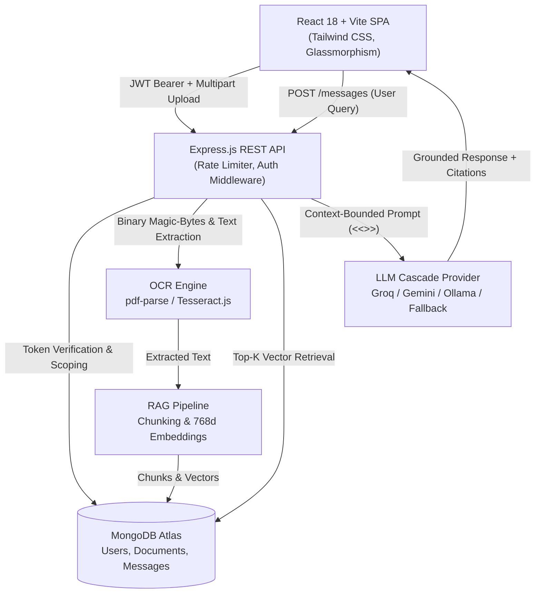

# DocuMind V2 — AI-Powered Document Assistant

> **Project Classification**: A deployable MVP / portfolio-grade full-stack application (MERN + AI + OCR + Vector RAG) engineered with enterprise-level security boundaries, multi-user data isolation, and automated CI/CD.

DocuMind is an intelligent document analysis assistant designed for students, legal analysts, and professionals reviewing contracts, invoices, research papers, and receipts. It allows users to upload PDF documents or scanned images, automatically extracts text using a dual-engine OCR pipeline with intelligent fallback, generates structured executive summaries, and supports context-grounded conversational Q&A powered by Retrieval-Augmented Generation (RAG).

---

## 🌟 Key Features & Engineering Highlights

- **Multi-User Data Isolation & Ownership Boundary**: Full JWT authentication and bcrypt password hashing. Every document, chat thread, and vector embedding is strictly scoped to the authenticated `User` (`User → Documents → Messages`). Unauthorized cross-tenant queries return `404 Not Found` to prevent ID enumeration.
- **Dual-Engine OCR with Scanned PDF Fallback**:
  - **Native Digital PDFs**: Direct high-speed text layer extraction via `pdf-parse`.
  - **Scanned / Image-Only PDFs**: Automatic threshold detection (< 50 characters) falling back to `tesseract.js` image extraction with memory caps (40MB) and per-page execution timeouts (30s).
- **RAG Architecture & Vector Search**:
  - Sliding-window semantic chunking (800 characters, 150-character overlap).
  - 768-dimensional normalized floating-point embedding vectors.
  - User-scoped in-memory Cosine Similarity ranking with MongoDB Atlas `$vectorSearch` compatibility.
  - Source citations returned with every answer (chunk indices & similarity scores).
- **Multi-Provider LLM Resilience (Zero RAM Overhead for 512MB Free Cloud Tiers)**:
  - **Groq Cloud API** (Recommended: `llama-3.3-70b-versatile`, 500+ tok/s, generous free tier, 0 server RAM consumed).
  - **Google Gemini** (`gemini-1.5-flash` via OpenAI-compatible endpoint).
  - **Local Ollama** (`qwen2.5:1.5b` for offline local machines).
  - **Cascading Failover & Offline Dev Grounding**: If external APIs are rate-limited (HTTP 429) or exhausted, the system automatically falls back to grounded document text extraction rather than crashing with a 500 error.
- **Enterprise Security Surface**:
  - Binary magic-byte header validation (`%PDF-`, JPEG `\xFF\xD8\xFF`, PNG `\x89PNG`), defeating extension/MIME spoofing.
  - Sliding-window rate limiting on auth (10 req/15 min) and file uploads (10 uploads/15 min).
  - Strict resource constraints (50MB max file size, 3,000 PDF page limit).
  - Prompt injection defense using explicit `<<<CONTEXT>>>` delimiter boundaries.
  - Secure cascade deletion: deleting a document wipes all associated messages and vector chunks.
- **Automated Testing & CI/CD**:
  - **51 Total Tests Passing**: 43 backend tests (Vitest + Supertest + MongoMemoryServer) and 8 frontend tests (Vitest + React Testing Library).
  - Active GitHub Actions workflow (`.github/workflows/ci.yml`) validating lint, tests, and production build on every push and PR.

---

## 🏛️ System Architecture



---

## 🔒 Security & Data Isolation Architecture

### 1. User → Documents → Messages Data Model
Every database operation enforces strict tenant isolation:
- `Document.find({ userId: req.userId })`
- `Document.findOne({ _id: docId, userId: req.userId })`
- `Message.find({ documentId: docId, userId: req.userId })`

### 2. Anti-Enumeration Defense
If User B attempts to access or delete `docAId` owned by User A, the system returns `404 Not Found` rather than `403 Forbidden`. This completely prevents malicious actors from enumerating valid document IDs across tenants.

### 3. Cascade Deletion
When a user deletes a document via `DELETE /api/documents/:id`, the backend atomically deletes both the document record and all associated chat messages owned by that user (`Message.deleteMany({ documentId: id, userId: req.userId })`).

### 4. File Signature (Magic-Byte) Validation
File extensions and MIME headers sent by browsers can easily be spoofed. Before processing, DocuMind reads the first 8 raw binary bytes directly from disk:
- **PDF**: `%PDF-` (`0x25 0x50 0x44 0x46 0x2D`)
- **JPEG**: `0xFF 0xD8 0xFF`
- **PNG**: `0x89 0x50 0x4E 0x47`

Any file failing magic-byte verification is unlinked from disk immediately and rejected with `400 Bad Request`.

---

## 🤖 RAG Architecture & Future Production Evolution

| Architectural Layer | Current Deployable MVP | Production Enterprise Roadmap |
| :--- | :--- | :--- |
| **Ingestion** | Synchronous Express request thread (capped at 50MB, 3000 pages) | Asynchronous worker queues (BullMQ + Redis / Celery + SQS) |
| **Chunking** | Overlapping character windows (800 chars, 150 overlap) | Semantic boundary chunking (headers, sentence trees, markdown parsing) |
| **Embeddings** | 768-dimensional normalized floating-point vectors | Domain-adapted embeddings (BGE-M3 / OpenAI text-embedding-3-large) |
| **Vector Storage** | MongoDB Atlas `$vectorSearch` + In-memory Cosine Similarity fallback | Dedicated Vector Database (**pgvector**, **Qdrant**, or **Milvus**) with HNSW indexing |
| **Retrieval** | Dense Top-K cosine similarity retrieval | **Hybrid Search**: Dense Vector + Sparse Lexical (BM25) via Reciprocal Rank Fusion |
| **Re-Ranking** | Direct score sorting | Cross-Encoder Re-ranker (Cohere Rerank / BGE-Reranker-Large) |
| **Hallucination Control** | Prompt bounding (`<<<CONTEXT>>>`) + system instructions | Agentic verification + RAGAS evaluation scoring |

---

## 📄 OCR Strategy for Scanned & Complex Documents

1. **Two-Stage Text Layer Detection**:
   - The document is first parsed with `pdf-parse`.
   - If extracted text contains **50 or more characters**, it is accepted as a digital text PDF (`extractionMethod: 'text'`).
   - If extracted text is under 50 characters, it is classified as a scanned document, automatically triggering Tesseract OCR (`extractionMethod: 'ocr'`).
2. **Resource Guardrails**:
   - Decompressed PDF image streams are capped at 40MB in RAM to prevent memory exhaustion.
   - Each page OCR operation has a strict 30-second timeout.
3. **Production Evolution for Complex Scans**:
   - **Rotated / Skewed Scans**: Leptonica deskewing & OpenCV edge rotation detection.
   - **Tables & Invoices**: Layout-aware parsing via LayoutLMv3, Camelot, or PaddleOCR.
   - **Multilingual Support (Urdu / Arabic)**: Tesseract multilingual trained data packs (`urd.traineddata`, `ara.traineddata`) or cloud OCR APIs (Google Cloud Vision / AWS Textract).

---

## ⚡ Multi-Provider LLM Setup (Solving Cloud 512MB RAM Limits)

> **Cloud Free Tier Limitation**: On cloud platforms like Render's free tier (512MB RAM), running local models with Ollama causes an immediate Out-Of-Memory (OOM) crash because LLMs require 1.5GB–4GB RAM minimum.

DocuMind solves this with a **resilient cloud LLM cascade**:
1. **Groq Cloud API** (`llama-3.3-70b-versatile`): **Recommended**. Ultra-fast (500+ tok/s), free tier with generous limits, and 0MB server RAM consumption.
2. **Google Gemini** (`gemini-1.5-flash`): Via OpenAI-compatible endpoint.
3. **Local Ollama** (`qwen2.5:1.5b`): Supported for local desktop development.
4. **Offline Grounded Fallback**: Deterministic text extraction fallback ensures unit tests and demos never crash even if API keys expire or rate limits are reached.

---

## 🧪 Testing Suite & CI/CD Pipeline

DocuMind features **51 automated tests** running in continuous integration:

### 1. Backend Test Matrix (43 Tests Passed)
```bash
cd backend
npm test
```
- `tests/auth.test.js`: User registration, duplicate emails, password hashing, JWT creation, `/api/auth/me` protected profile.
- `tests/documents.test.js`: Multi-tenant data isolation, cross-user 404 anti-enumeration, cascade message deletion, magic-byte header validation, invalid ObjectId handling.
- `tests/ocr.test.js`: Native text PDF extraction, scanned PDF OCR fallback (<50 chars), corrupted file handling, 3000-page limit rejection, image magic bytes.
- `tests/rag.test.js`: Chunking service, 768d vector embeddings, cosine similarity ranking, Top-K retrieval, prompt grounding delimiters (`<<<CONTEXT>>>`), source citations, missing JWT_SECRET error handling.

### 2. Frontend Test Matrix (8 Tests Passed)
```bash
cd frontend
npm test
```
- Component tests for Auth forms, ChatMessage rendering, ConfirmModal, Dashboard OCR indicators, and Empty/Error state views.

### 3. Production Build Validation
```bash
cd frontend
npm run build
```
- Compiles production Vite bundle with zero TypeScript/ESBuild errors.

### 4. GitHub Actions Workflow (`.github/workflows/ci.yml`)
Runs on every push/PR to validate:
`Checkout → Node 20 Setup → npm ci → Backend Tests → Frontend Tests → Frontend Production Build`.

---

## 🚀 Quick Start Guide

### Prerequisites
- Node.js v18+ (v20 LTS recommended)
- MongoDB Atlas connection string
- (Optional) Free Groq API Key from [console.groq.com](https://console.groq.com) OR Google Gemini API Key from [aistudio.google.com](https://aistudio.google.com)

### 1. Backend Setup
```bash
cd backend
npm install
```
Configure `backend/.env`:
```env
PORT=5000
NODE_ENV=development
CORS_ORIGIN=http://localhost:5173
MONGO_URI=your_mongodb_connection_string_here
JWT_SECRET=your_super_secret_jwt_key_at_least_32_chars

# Option A: Groq (Recommended - Free, ultra-fast, 0 RAM usage)
GROQ_API_KEY=gsk_your_groq_api_key_here
GROQ_MODEL=llama-3.3-70b-versatile

# Option B: Gemini (OpenAI-compatible)
LLM_API_KEY=your_gemini_api_key_here
LLM_API_BASE_URL=https://generativelanguage.googleapis.com/v1beta/openai/
LLM_MODEL_NAME=gemini-1.5-flash
```
Start backend server:
```bash
npm run dev
# Running on http://localhost:5000
```

### 2. Frontend Setup
```bash
cd frontend
npm install
npm run dev
# Running on http://localhost:5173
```

---

## 📡 API Reference

| Method | Route | Description | Auth Required | Rate Limit |
| :--- | :--- | :--- | :--- | :--- |
| `GET` | `/api/health` | Service health status | No | Unlimited |
| `POST` | `/api/auth/register` | Register new user & return JWT token | No | 10 req / 15 min |
| `POST` | `/api/auth/login` | Login user & return JWT token | No | 10 req / 15 min |
| `GET` | `/api/auth/me` | Get authenticated user profile | Yes (Bearer) | Unlimited |
| `POST` | `/api/documents/upload` | Upload PDF/image, validate magic bytes, run OCR & RAG | Yes (Bearer) | 10 req / 15 min |
| `GET` | `/api/documents` | List authenticated user's documents | Yes (Bearer) | Unlimited |
| `GET` | `/api/documents/:id` | Fetch document details & extracted text | Yes (Bearer) | Unlimited |
| `DELETE` | `/api/documents/:id` | Delete document & cascade delete chat history | Yes (Bearer) | Unlimited |
| `POST` | `/api/documents/:id/messages` | Submit question, run RAG vector search, get AI answer | Yes (Bearer) | Unlimited |
| `GET` | `/api/documents/:id/messages` | Fetch conversation history for document | Yes (Bearer) | Unlimited |
| `POST` | `/api/documents/:id/summarize`| Generate or fetch cached AI executive summary | Yes (Bearer) | Unlimited |

---

## 🎓 Technical Interview Quick Reference

For technical interview discussions regarding architecture, tradeoffs, and design decisions:
- **MERN vs FastAPI**: Demonstrates full-stack web development maturity (two-tier architecture, middleware, client state management, database schema design) instead of an isolated Python script.
- **Scanned PDF Handling**: 2-stage pipeline (`pdf-parse` → length threshold check → `tesseract.js` image OCR on raw page streams).
- **Anti-Hallucination**: Explicit `<<<CONTEXT>>>` tagging, Top-K chunk retrieval, temperature 0.3, and mandatory citation sources metadata.
- **Multi-Tenant Isolation**: Cryptographic JWT validation, user-scoped queries, anti-enumeration 404 responses, and cascade message deletion.
- **RAG Evolution**: Progression from in-memory cosine similarity to **pgvector / Qdrant**, hybrid dense/sparse search (BM25 + vectors), and Cross-Encoder re-ranking.
- **Cloud 512MB RAM Optimization**: Offloading LLM inference to cloud providers (Groq/Gemini) with automatic failover to prevent container OOM crashes.

---

## 📝 License
Distributed under the MIT License. See `LICENSE` for details.

